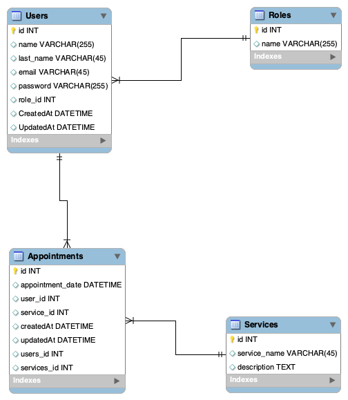

# REST API: backend-tattoo (tattoo studio project)

## Tabla de contenidos :file_folder:

1. [Descripción](#descripción) :classical_building:
2. [Stack](#stack) :gear:
3. [Características](#características)
4. [Endpoints](#enpoints)
5. [Base de datos](basededatos) 
6. [Instalación](#instalación)
7. [Implementación](#implementación)
8. [Link del proyecto](#link) 
9. [Desarrollador](#desarrollador)

 ## 1. <a id="descripción">Descripción</a>

Este proyecto consiste en crear una REST API para un estudio de tatuajes que permita a los diferentes tipos de usuarios ver sus citas, modificar sus datos existentes, crear nuevod uduarios, y en caso de administradores cabiar roles de otros usuarios

## 2. <a id="stack">Stack</a>
- ORM: 
- Language: 
- Framework: 

## 3. <a id="features">Características</a>

- Registro de usuario e inicio de sesión
- Cambio de datos del usuario
- Solicitar una cita
- Cambiar o cancelar una cita

## 4. <a id="enpoints">Endpoints</a>

### Authentication

| Method | URI                           | Action                 |
|--------|-------------------------------|------------------------|
| POST   | `/api/auth/register`          | User Registration      |
| POST   | `/api/auth/login`             | User login             |

### Users

| Method | URI                                    | Action                       | Rol         |
|--------|----------------------------------------|------------------------------|-------------|
| GET    | `/api/users`                           | Ver los usuarios             | super_admin |
| GET    | `/api/users/profile`                   | Ver nuestro perfil           |             |
| PUT    | `/api/users/profile`                   | Modificar nuestro perfil     |             |
| DELETE | `/api/users/:id`                       | Borrar usuario               | super_admin |
| PUT    | `/api/users/:id/role`                  | Cambiar rol                  | super_admin |
| GET    | `/api/users/artist`                    | Listado artistas             | super_admin |


### Appointments

| Method | URI                     | Action                   | Rol  |
|--------|-------------------------|--------------------------|------|
| POST   | `/api/appointments`     | Crear cita               |      |
| PUT    | `/api/appointments`     | Modificar cita           |      |
| GET    | `/api/appointments/:id` | Recuperar cita           |      |
| GET    | `/api/appointments`     | Ver mi cita              |      |


### Services

| Method | URI                 | Action                   | Rol         |
|--------|---------------------|--------------------------|-------------|
| GET    | `/api/services`     | Ver mis citas            |             |
| POST   | `/api/services`     | Crear cita               | super_admin |
| PUT    | `/api/services/:id` | Modificar cita           | super_admin |
| GET    | `/api/services/:id` | ver mi cita              | super_admin |

## 5. <a id="basededatos">Base de datos</a> :open_book:


## 6. <a id="instalación">Instalación </a>
Para la instalación del proyecto, siga los siguientes pasos en el correspondiente órden:

- Abre tu terminal e introduce el siguiente comando:
```sh
    git clone https://github.com/agomsan/backend-tattoo
```
- Abre el proyecto que acabas de clonar en el editor de código de tu preferencia
- Ejecuta el siguiente comando para instalar los paquetes necesarios para su funcionamiento:
```sh
    npm install
```

## 7. <a id="implementación">Implementación </a>
- Crea un archivo .env y copia lo que aparece dentro de .env-example y modifica los parámetros necesarios en base a tu base de datos
- Introduce las credenciales en el archivo config
- Crea la base de datos
- Ejecuta la migración
```sh
    npm run migrate
```
- Ejecuta el Seed
```sh
    npm run seed
```
- Ejecuta el proyecto
```sh
    npm run dev
```

  
## 8. <a id="link">Link</a> 

https://github.com/agomsan/newbackend.git

## 9. <a id="desarrollador">Desarrollador</a> :wave:

- **Alejandro Gómez**
- [GitHub](https://github.com/agomsan)

